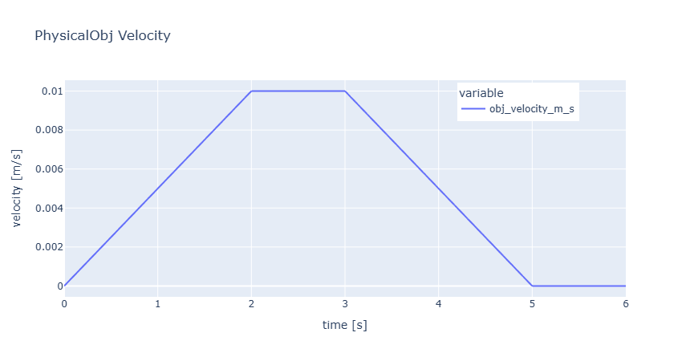
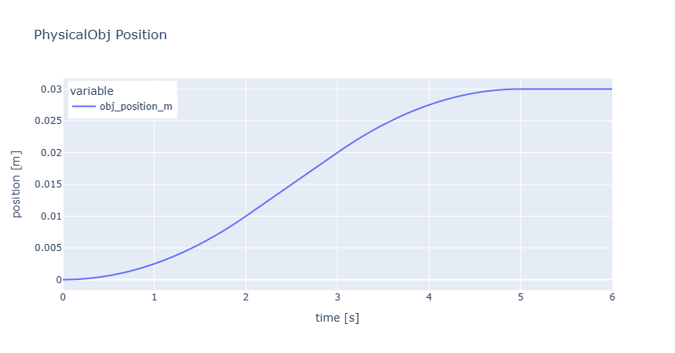

```
Copyright 2025 Takayoshi Matsuyama

Licensed under the Apache License, Version 2.0 (the "License");
you may not use this file except in compliance with the License.
You may obtain a copy of the License at

    http://www.apache.org/licenses/LICENSE-2.0

Unless required by applicable law or agreed to in writing, software
distributed under the License is distributed on an "AS IS" BASIS,
WITHOUT WARRANTIES OR CONDITIONS OF ANY KIND, either express or implied.
See the License for the specific language governing permissions and
limitations under the License.
```

update: 2025/11/30

# モーションシミュレータ

# 1. 動機
モーション制御に関する組み込みシステムの開発に携わっています。<br>
「制御理論から実機械への応用まで」を、きちんと実践できるようにしたい。<br>
そのための学習として、このモーションシミュレータを作成しました。

# 2. コンセプト
  組み込み制御システムのフローに基づく、離散時系列の制御シミュレータ。<br>
  （指令計算 ⇒ 操作量計算 ⇒ 物体の運動変化 ⇒ フィードバック）

## 2.1 特徴
1. 「MotionFlow（モーション制御フロー）」 クラスを中心に概念整理した、現実に即した分かりやすいオブジェクト指向設計
2. カスタマイズ可能（JSONファイルでパラメータ設定）
3. 拡張可能（系統的に設計したPythonパッケージ構成とバージョン管理）

## 2.2 用途
1. 組み込み制御システムの検証
2. 制御工学の学習

# 3. 使用例
Jupyter Notebookで実行する例を示す。

## 3.1 シミュレーション実行

```
import pandas ad pd         # パッケージのインポート (pandas 表形式データ処理)
import tkmotion as tkm      # パッケージのインポート (モーションシミュレータ)

flow = tkm.MotionFlow()     # モーション制御フローのインスタンスを作成
flow.load_discrete_time()   # 離散時系列の設定をロード (デフォルト Δt=100[μs]、継続時間=6[s])
flow.load_motion_profile()  # モーションプロファイルの設定をロード (デフォルト 台形速度)
flow.load_controller()      # コントローラの設定をロード (デフォルト PIDコントローラ)
flow.load_plant()           # プラントの設定をロード (デフォルト 質量を持つ物体)
df = flow.execute()         # 制御フローを実行。結果をpandas.DataFrame形式で得る
```

## 3.2 実行結果をグラフで確認

### 3.2.1 物体の速度変化
DataFrameから「経過時間 "time_s"」と「物体速度 "obj_velocity_m_s"」を取り出し、<br>
グラフ描画パッケージ plotly.express でlineプロットを作成する。
```
import plotly.express as px
fig = px.line(df, x="time_s", y=["obj_velocity_m_s"], title="PhysicalObj Velocity")
fig.update_layout(
    xaxis=dict(title="time [s]"),
    yaxis=dict(title="velocity [m/s]"),
    legend=dict(yanchor="top", y=0.99, xanchor="left", x=0.7))
fig.show()
```


### 3.2.2 物体の位置変化
DataFrameから「経過時間 "time_s"」と「物体位置 "obj_position_m"」を取り出し、<br>
グラフ描画パッケージ plotly.express でlineプロットを作成する。
```
import plotly.express as px
fig = px.line(df, x="time_s", y=["obj_position_m"], title="PhysicalObj Position")
fig.update_layout(
    xaxis=dict(title="time [s]"),
    yaxis=dict(title="position [m]"),
    legend=dict(yanchor="top", y=0.99, xanchor="left", x=0.01))
fig.show()
```


# 4. 設計

## 4.1 Pythonパッケージ（ディレクトリ）とモジュール（.pyファイル）の構成
```
tkmotion/
	__init__.py  # ディレクトリをPythonパッケージとして扱わせるためのスクリプトファイル
	flow/  # motion flow / モーション制御フロー
		__init__.py
		motion_flow.py
	time/  # time series / 時系列
		__init__.py
		discrete_time.py
		default_discrete_time.json  # 離散時系列 デフォルト設定
	prof/  # motion profile / モーションプロファイル
		__init__.py
		motion_profile.py
		default_motion_prof.json  # モーションプロファイル デフォルト設定
	ctrl/  # motion control / モーション制御
		__init__.py
		controller.py
		default_controller.json  # コントローラ デフォルト設定
	plant/  # plant (control target) / プラント (制御対象)
		__init__.py
		plant.py
		physical_object.py
		default_plant.json  # プラント デフォルト設定
	util/  # utility / ユーティリティ
		__init__.py
		utility.py
```

## 4.2 モジュールとクラス

### 4.2.1 パッケージ: tkmotion.flow
motion flow / モーションフロー

| モジュール | ver | クラス | 責務 | 主要特性 |
| -- | -- | -- | -- | -- |
| motion_flow.py | 0.0.1 | MotionFlow<br>(モーション制御フロー) | モーション指令の流れを司り、<br>シミュレーションを実行 | load_discrete_time()<br>load_motion_profile()<br>load_controller()<br>load_plant()<br>execute() |

### 4.2.2 パッケージ: tkmotion.time
time series / 時系列

| モジュール | ver | クラス | 責務 | 主要特性 |
| -- | -- | -- | -- | -- |
| discrete_time.py | 0.0.1 | DiscreteTime<br>(離散時間) | 間隔Δtの離散時系列を表現 | get_time_step_generator() |
| ↑ | ↑ | DiscreteTimeLoader<br>(離散時間ローダ) | 設定 (jsonファイル) を読み込み、<br>DiscreteTimeクラスのインスタンスを生成 | load() |

### 4.2.3 パッケージ: tkmotion.prof
motion profile / モーションプロファイル

| モジュール | ver | クラス | 責務 | 主要特性 |
| -- | -- | -- | -- | -- |
| motion_profile.py | 0.0.1 | MotionProfile<br>(モーションプロファイル) | モーションプロファイルのベースクラス。<br>モーションプロファイルの共通特性を定義 | calculate_cmd_vel_pos() |
| ↑ | ↑ | TrapezoidalMotionProfile<br>(台形モーションプロファイル) | 台形状に変化する速度（加速・定速・減速）から<br>指令速度・指令位置を計算する | ↑ |
| ↑ | ↑ | MotionProfileLoader<br>(モーションプロファイルローダ) | 設定 (jsonファイル) を読み込み、<br>MotionProfileクラスのインスタンスを生成 | load() |
| ↑ | ↑ | VelocityZeroOrMinusError<br>(速度ゼロ・マイナスエラー)  | 設定速度がゼロ、またはマイナスの例外を表す | - |
| ↑ | ↑ | AccelerationZeroOrMinusError<br>(加速度ゼロ・マイナスエラー) | 設定加速度がゼロ、またはマイナスの例外を表す | - |
| ↑ | ↑ | MovingLengthZeroError<br>(移動距離ゼロエラー) | 設定移動量がゼロの例外を表す | - |

### 4.2.4 パッケージ: tkmotion.ctrl
motion control / モーション制御

| モジュール | ver | クラス | 責務 | 主要特性 |
| -- | -- | -- | -- | -- |
| controller.py | 0.0.1 | Controller<br>(コントローラ) | コントローラのベースクラス。<br>コントローラの共通特性を定義 | reset()<br>calculate_force() |
| ↑ | ↑ | PIDController<br>(PIDコントローラ) | PID計算を実行するコントローラ<br>・Proportional 比例<br>・Integral 積分<br>・Derivative 微分 | kvp, kvi, kvd<br>kpp, kpi, kpd<br>reset()<br>calculate_force() |
| ↑ | ↑ | ControllerLoader<br>(コントローラローダ) | 設定 (jsonファイル) を読み込み、<br>Controllerクラスのインスタンスを生成 | load() |

### 4.2.5 パッケージ: tkmotion.plant
plant (control target)  / プラント (制御対象)

| モジュール | ver | クラス | 責務 | 主要特性 |
| -- | -- | -- | -- | -- |
| plant.py | 0.0.1 | Plant<br>(プラント) | 制御対象を表現する | physical_obj |
| ↑ | ↑ | PlantLoader<br>(プラントローダ) | プラントの設定 (jsonファイル) を読み込み、<br>Plantクラスと、Plantに属する各クラスのインスタンスを生成 | load() |
| ↑ | ↑ | PhysicalObject<br>(物理オブジェクト) | 現実の物体を表現する | mass<br>acc, vel, pos<br>reset()<br>apply_force() |

### 4.2.6 パッケージ: tkmotion.util
utility / ユーティリティ

| モジュール | ver | クラス | 責務 | 主要特性 |
| -- | -- | -- | -- | -- |
| utility.py | 0.0.1 | Utility<br>(ユーティリティ) | 共通の補助機能を定義する | is_config_compatible() |
| ↑ | ↑ | ConfigVersionIncompatibleError<br>(設定バージョン非互換エラー) | 設定バージョンに互換性がない例外を表す | - |

## 4.3 クラス図 (概要)


